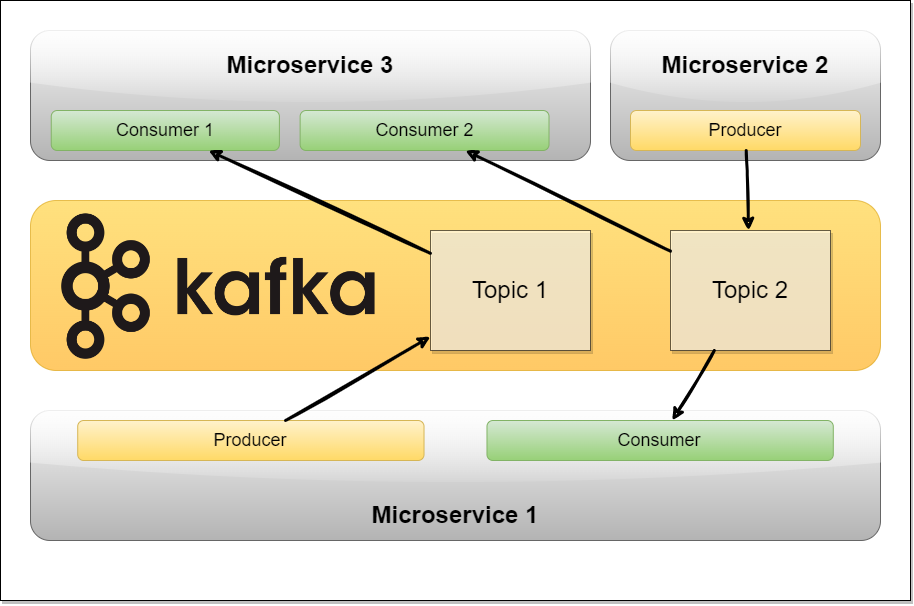

# Event-driven-microservices

Event-driven microservices are a specific architectural pattern where the communication and coordination between different microservices are based on events. In this pattern, microservices communicate by producing and consuming events asynchronously. Events represent significant occurrences or changes in the system, and they can be generated by a microservice and then consumed by other microservices that are interested in those events.

Let's break down the concept of event-driven microservices in more detail:

1. **Microservices**: Microservices are a software architectural style where applications are built as a collection of small, loosely coupled, and independently deployable services. Each microservice focuses on a specific business capability and can be developed, deployed, and scaled independently.

2. **Events**: In an event-driven architecture, events represent significant changes or occurrences in the system. An event can be any notable activity or state change that other microservices might be interested in. For example, an event could be the creation of a new user, an order being placed, a payment being processed, or a file being uploaded.

3. **Event Producer**: A microservice that generates events is called an event producer. When a particular action or state change occurs within a microservice, it publishes an event to a message broker or an event streaming platform. The event contains relevant information about the occurrence, such as the event type and any associated data.

4. **Event Consumer**: Microservices that are interested in certain types of events subscribe to those events and act as event consumers. They listen to the event stream or message broker and react accordingly when relevant events occur. Event consumers can perform various actions, such as updating their own internal state, triggering additional processes, or communicating with other microservices.

5. **Event Brokers/Streaming Platforms**: Event-driven microservices rely on a communication infrastructure to facilitate the distribution and consumption of events. This infrastructure is typically provided by message brokers or event streaming platforms. Examples of popular event streaming platforms include Apache Kafka, RabbitMQ, and Amazon Kinesis. These platforms ensure reliable delivery, persistence, and scalability of events.

6. **Loose Coupling and Scalability** : Event-driven microservices promote loose coupling between services. Each microservice only needs to be aware of the events it produces and the events it needs to consume. This decoupling allows microservices to be developed and scaled independently, as long as they adhere to a common set of events and their associated contracts (event schemas).

7. **Event Sourcing and CQRS** : Event-driven microservices can also leverage concepts like event sourcing and Command Query Responsibility Segregation (CQRS). Event sourcing involves persisting events as the source of truth and deriving the current state of a microservice by replaying events. CQRS separates the read and write models, allowing for specialized query models optimized for different use cases.

The benefits of event-driven microservices include increased scalability, resilience, and flexibility. By decoupling services through asynchronous event-based communication, you can build systems that are more resilient to failures, handle increased traffic loads, and adapt more easily to changing business requirements.

However, implementing event-driven microservices also introduces additional complexity, such as managing eventual consistency and dealing with event ordering, replaying events for recovery, and ensuring data integrity across microservices. These challenges require careful design and consideration of the system's requirements and trade-offs.

Overall, event-driven microservices offer a powerful approach to building distributed systems that can efficiently handle complex and evolving business scenarios by leveraging asynchronous communication and event-driven architecture principles.
